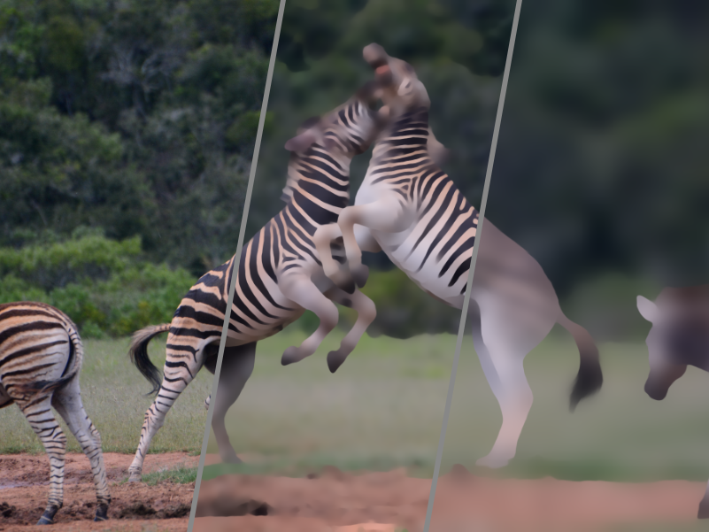

<div align="center">

# [CVPR 2026] Semantic Scale Space: A Framework for Controllable Image Abstraction

**Kazu Mishiba**  
Tottori University

</div>

This repository provides the public AGSS release accompanying the CVPR 2026 paper *Semantic Scale Space: A Framework for Controllable Image Abstraction*.

The current public snapshot focuses on the AGSS-related components of the paper: reproducible single-image inference and a limited AGSS-only workflow for target-RHI-guided smoothing-strength selection. Third-party components, datasets, and nonessential evaluation code are intentionally kept outside this release.



*AGSS performs controllable image abstraction by progressively increasing smoothing strength while preserving important structure using externally predicted boundary maps.*


## Scope and non-goals

This release is intentionally limited in scope.

Included:
- single-image AGSS inference
- AGSS-only target-RHI matching for a limited smoothing-strength selection workflow

In the context of the paper, this repository should be read as a compact implementation release for the AGSS portion, rather than as the full project release for every method and experiment described in the paper.

Not included:
- baseline methods such as WLS, PM, GF-it, or DT+MuGE
- BPF / Drift computation
- full benchmark reproduction
- extended evaluation pipelines beyond the AGSS release scope
- user study code
- MuGE source code or checkpoints
- dataset redistribution

## External dependency

AGSS uses MuGE as an external dependency for boundary prediction.

Target upstream repository:
- https://github.com/ZhouCX117/UAED_MuGE

Users must prepare the following separately:
1. a local clone of the MuGE repository
2. a MuGE checkpoint obtained from the original distribution

This repository does not bundle MuGE source code, MuGE checkpoints, or datasets.

A recommended local layout is:

```text
agss/
├── external/
│   ├── UAED_MuGE/
│   └── checkpoints/
│       └── model_alpha.pth
├── src/
└── ...
```

The CLI defaults assume this layout.

The MuGE repository path and the MuGE checkpoint path are treated as independent paths. If your local layout differs from the example above, pass both paths explicitly through the CLI options.

## Installation

From the repository root:

1. Install a PyTorch build compatible with your local environment.

2. Install this package:

```bash
pip install -e .
```

3. If required, install the upstream MuGE dependencies in the same environment.

## Tested environment

The current public code is intended primarily for:

* Ubuntu
* Python >= 3.10
* PyTorch with CUDA support

GPU execution is the expected primary path. CPU execution may be possible depending on the local environment, but it is not the primary tested configuration in this public snapshot.

## Quick start

### 1. Single-image AGSS inference

```bash
agss-infer \
  --input /path/to/input.png \
  --output /path/to/output.png \
  --alpha-keys 3,2,1,0 \
  --n-iters 500 \
  --radius 1 \
  --delta-base 1e-6 \
  --decay 0.4 \
  --xi 1e-6 \
  --device cuda
```

If MuGE is not placed under `external/`, override the paths explicitly:

```bash
agss-infer \
  --input /path/to/input.png \
  --output /path/to/output.png \
  --muge-repo /custom/path/to/UAED_MuGE \
  --muge-checkpoint /custom/path/to/model_alpha.pth
```

### 2. Target-RHI matching for AGSS only

This command performs the following steps:

* computes a Gaussian-reference `target_rhi`
* runs AGSS and collects candidate stopping points
* selects the AGSS candidate whose RHI is closest to the target
* uses the provided ground-truth boundary only to define the non-boundary region for target-RHI computation

```bash
agss-e1-partial \
  --input /path/to/input.png \
  --gt-boundary /path/to/gt_boundary.png \
  --output /path/to/e1_selected.png \
  --target-level sigma2 \
  --candidate-stride 5 \
  --alpha-keys 3,2,1,0 \
  --n-iters 300 \
  --radius 1 \
  --delta-base 1e-6 \
  --decay 0.4 \
  --xi 1e-6 \
  --device cuda
```

## Outputs

This target-RHI matching workflow generates:

* the selected AGSS output image
* a JSON summary containing:

  * `target_sigma`
  * `target_rhi`
  * per-candidate achieved RHI
  * per-candidate absolute RHI error
  * selected iteration / stage context
  * AGSS run metadata

This public snapshot does not include BPF / Drift evaluation.

## Main CLI controls

The main AGSS controls exposed by the CLI are:

* `alpha-keys`
* `n-iters`
* `radius`
* `delta-base`
* `decay`
* `xi`

Refer to the command help for the complete list of options.

## First-run behavior

The first run may trigger an upstream `efficientnet-b7` weight download if the local Torch cache is empty.

## Implementation notes

The current MuGE adapter pads each input image to the next multiple of 32 before boundary prediction and crops the predicted boundary map back to the original image size afterward.

## Reproducibility and container notes

Additional setup and reproducibility notes are documented separately:

* [docs/REPRODUCIBILITY.md](docs/REPRODUCIBILITY.md): direct Python-environment setup
* [docs/CONTAINER.md](docs/CONTAINER.md): Docker / Compose-based setup

## Known limitations

* This is a minimal public snapshot rather than a full reproduction package.
* Only AGSS is included in the public workflow.
* MuGE must be installed and prepared separately by the user.
* The current MuGE adapter expects the upstream MuGE repository to keep the same internal file structure and model entry points as the version used during development.
* Baseline methods and full benchmark code are intentionally excluded.

## License

The original code in this repository is released under the Apache-2.0 License.

This repository does not redistribute MuGE source code, MuGE checkpoints, or datasets. Their use is subject to the terms, licenses, and distribution conditions of their original sources.

## Publication and citation

If you use this repository, please cite the following paper.

### BibTeX

```bibtex
@inproceedings{mishiba2026semantic,
  title     = {Semantic Scale Space: A Framework for Controllable Image Abstraction},
  author    = {Mishiba, Kazu},
  booktitle = {Proceedings of the IEEE/CVF Conference on Computer Vision and Pattern Recognition (CVPR)},
  year      = {2026},
  pages     = {17367-17376}
}
```

## Paper note

In the CVPR 2026 paper, the Drift computation was described as symmetric Chamfer distance. More precisely, the implementation used in the experiments computed the average of the two directed Hausdorff distances between the predicted and ground-truth boundary point sets.

## Further documentation

* [docs/REPRODUCIBILITY.md](docs/REPRODUCIBILITY.md): setup and execution notes
* [docs/CONTAINER.md](docs/CONTAINER.md): container-oriented usage notes

